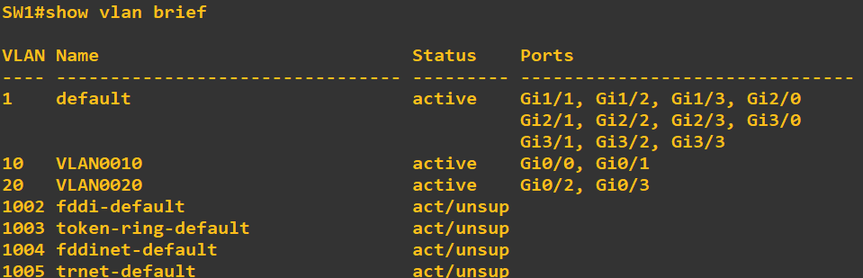

# Network Security Lab


## Overview
This lab demonstrates core Layer 2 security mechanisms in a routed and VLAN-segmented network using **GNS3**.  
The focus is on protecting the access layer against common attacks such as rogue DHCP servers, MAC spoofing, and ARP poisoning.

The following security features are implemented and tested:
- **Port Security**
- **DHCP Snooping**
- **Dynamic ARP Inspection (DAI)**

---

## IP Addressing Plan

### VLANs
| VLAN | Name     | Subnet        | Gateway        |
|-----:|----------|---------------|----------------|
| 10   | USERS_10 | 10.0.10.0/24  | 10.0.10.254   |
| 20   | USERS_20 | 10.0.20.0/24  | 10.0.20.254   |

### Routed Links
| Link        | Subnet            |
|------------|-------------------|
| R1 – R2    | 192.168.13.0/30   |
| DHCP - R2  | 172.18.10.0/28    |

---

## VLAN Configuration
- VLANs 10 and 20 are created on **SW1**
- Access ports are statically assigned to their respective VLANs
- The uplink between **SW1 ↔ R1** is configured as a trunk



---

# Port Security

### Purpose
Prevents attackers from getting access to the network via ethernet port.

### Configuration Overview
- Enabled on **SW1's** access ports (end users)
- Violation mode is **shutdown**
- **Errdisable recovery** is enabled for port security violations

### Key Configuration
```shell
SW1(config-if-range)# port-security
SW1(config-if-range)# port-security violation shutdown
SW1(config-if-range)# port-security mac-address sticky
SW1(config)# errdisable recovery cause psecure-violation
SW1(config)# errdisable recovery interval 500
```

## Show Commands

### show port security


---

### show port security int g0/1


---

### show errdisable recovery


# DHCP Snooping

### Purpose
Prevents rogue DHCP servers by allowing DHCP responses only from trusted ports.

### Configuration Overview
- Enabled globally on **SW1**
- Enabled for VLANs **10 and 20**
- Trunk/uplink ports marked as **trusted**
- Access ports remain **untrusted**

### Key Configuration 
```shell
SW1(config)# ip dhcp snooping
SW1(config)# ip dhcp snooping vlan 10,20
SW1(config)# no ip dhcp information option
SW1(config-if)# ip dhcp snooping trust (Interface G0/1 to R1)
```

## Show Commands

---

### show ip dhcp snooping


---

### show ip dhcp snooping binding


# Dynamic Arp Inspection (DAI)

### Purpose
Prevents MITM attacks like ARP poisoning and ARP spoofing

### Configuration Overview
- Enabled globally on **SW1**
- Enabled on **SW1** in VLANs 10,20
- Trunk/uplink ports marked as **trusted** like DHCP snooping
- Access ports remain **untrusted** like DHCP snooping

### Key Configuration
```shell
SW1(config)# ip arp inspection vlan 10,20
SW1(config)# ip arp inspection validate src-mac dst-mac ip
SW1(config-if)# ip arp inspection trust (SW1 TO R1)
SW1(config-if-range)# ip arp inspection limit rate 25 burst interval 2
```

## Show Commands

### show ip arp inspection


---

### sgiw ip arp inspection interfaces


---

### show ip arp inspection statistics


