# Network Security Lab

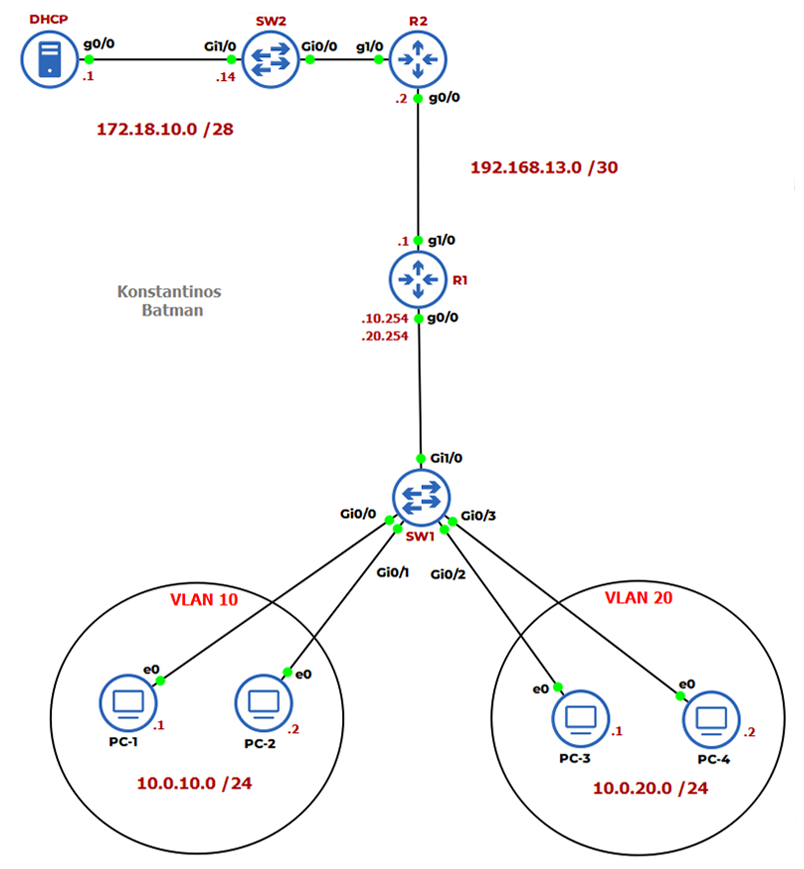

# Overview
This lab demonstrates core Layer 2 security mechanisms in a routed and VLAN-segmented network using **GNS3**.  
The focus is on protecting the access layer against common attacks such as rogue DHCP servers, MAC spoofing, and ARP poisoning.

The following security features are implemented and tested:
- **Port Security**
- **DHCP Snooping**
- **Dynamic ARP Inspection (DAI)**

---

# Port Security

### Purpose
Prevents attackers from getting access to the network via ethernet port.

### Configuration Overview
- Enabled on **SW1's** access ports (end users)
- Violation mode is **shutdown**
- **Errdisable recovery** is enabled for port security violations

### Key Configuration
```shell
SW1(config-if-range)# port-security
SW1(config-if-range)# port-security violation shutdown
SW1(config-if-range)# port-security mac-address sticky
SW1(config)# errdisable recovery cause psecure-violation
SW1(config)# errdisable recovery interval 500
```

## Show Commands

### show port security
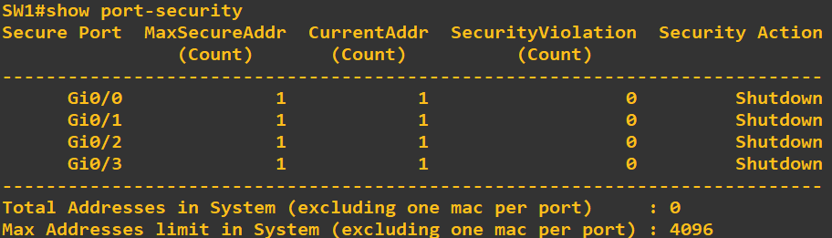

---

### show port security int g0/1


---

### show errdisable recovery
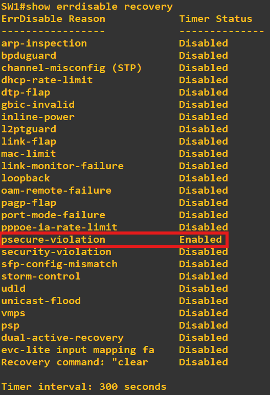

# DHCP Snooping

### Purpose
Prevents rogue DHCP servers by allowing DHCP responses only from trusted ports.

### Configuration Overview
- Enabled globally on **SW1**
- Enabled for VLANs **10 and 20**
- Trunk/uplink ports marked as **trusted**
- Access ports remain **untrusted**

### Key Configuration 
```shell
SW1(config)# ip dhcp snooping
SW1(config)# ip dhcp snooping vlan 10,20
SW1(config)# no ip dhcp information option
SW1(config-if)# ip dhcp snooping trust (Interface G0/1 to R1)
```

## Show Commands

---

### show ip dhcp snooping
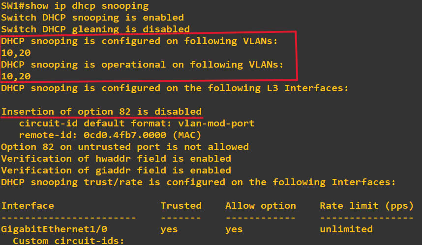

---

### show ip dhcp snooping binding
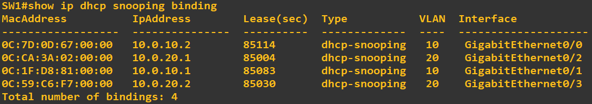

# Dynamic Arp Inspection (DAI)

### Purpose
Prevents MITM attacks like ARP poisoning and ARP spoofing

### Configuration Overview
- Enabled globally on **SW1**
- Enabled on **SW1** in VLANs 10,20
- Trunk/uplink ports marked as **trusted** like DHCP snooping
- Access ports remain **untrusted** like DHCP snooping

### Key Configuration
```shell
SW1(config)# ip arp inspection vlan 10,20
SW1(config)# ip arp inspection validate src-mac dst-mac ip
SW1(config-if)# ip arp inspection trust (SW1 TO R1)
SW1(config-if-range)# ip arp inspection limit rate 25 burst interval 2
```

## Show Commands

### show ip arp inspection
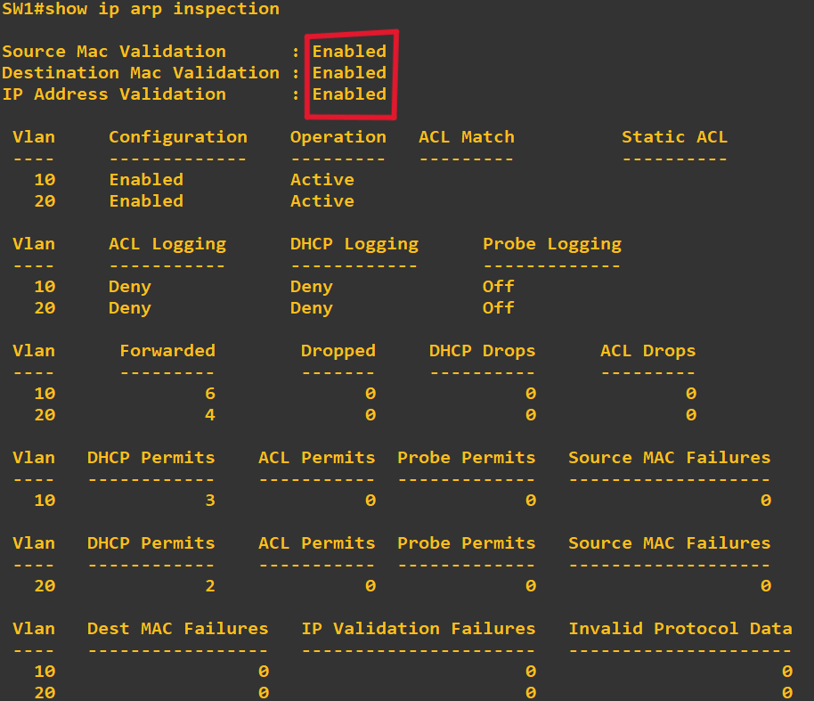

---

### show ip arp inspection interfaces
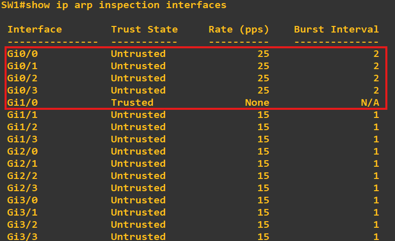

---

### show ip arp inspection statistics
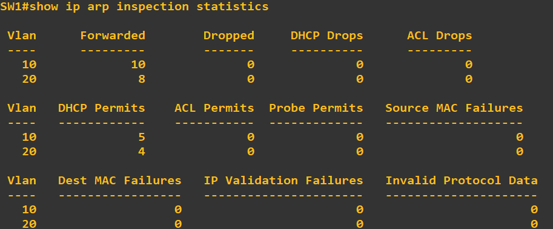

---

# Attacker Prevention Example

### The rogue PC disconnected PC1 and plugged in his own
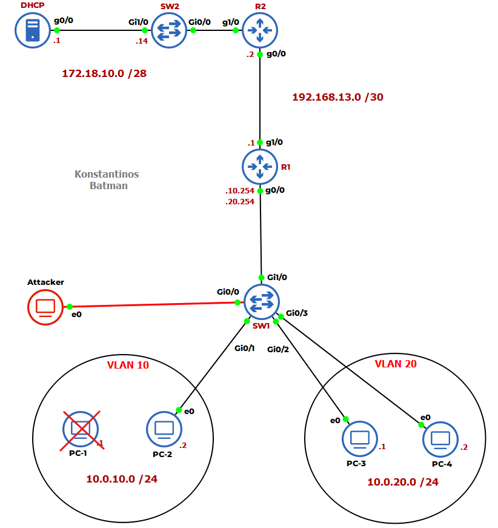

### Syslog Messages when Attacker plugged in
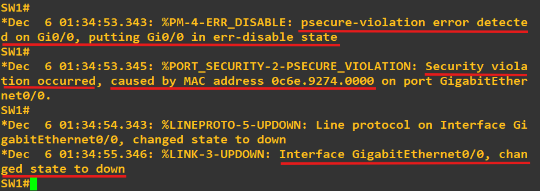

### Show port security after Attacker plugged in 
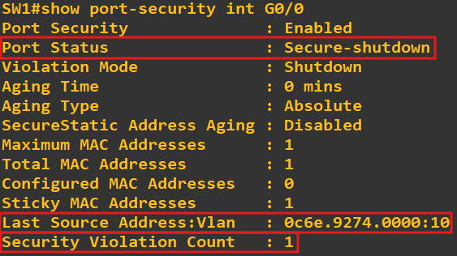

---

# Expected Results

After completing the configuration and verification steps in this lab, the following results are expected:

1. **DHCP Snooping Operation**
   - DHCP Snooping is enabled globally and per VLAN on the access switch.
   - DHCP responses are accepted only from trusted ports connected to the legitimate DHCP server.
   - Rogue or unauthorized DHCP servers are blocked on untrusted access ports.
   - Valid DHCP bindings are created for end hosts and can be verified in the DHCP Snooping binding table.

2. **Port Security Enforcement**
   - Access ports accept traffic only from authorized MAC addresses.
   - The maximum allowed number of MAC addresses per port is enforced.
   - When a violation occurs (e.g., MAC spoofing or multiple devices connected), the configured violation action is triggered.
   - Learned MAC addresses are correctly recorded when sticky MAC learning is enabled.

3. **Dynamic ARP Inspection (DAI) Protection**
   - DAI validates ARP packets against the DHCP Snooping binding table.
   - Legitimate ARP traffic is permitted between hosts in the same VLAN.
   - Malicious or spoofed ARP packets are dropped on untrusted ports.
   - Trusted uplink ports allow valid ARP traffic without inspection errors.

4. **End-User Connectivity**
   - Hosts receive valid IP address assignments from the DHCP server.
   - Normal network connectivity is maintained for legitimate users.
   - Security features operate transparently without impacting authorized traffic.

5. **Verification and Monitoring**
   - `show ip dhcp snooping` confirms DHCP Snooping status and configuration.
   - `show port-security` verifies Port Security settings and violation counts.
   - `show ip arp inspection` confirms Active Dynamic ARP Inspection functionality.

Successful observation of these results confirms that the access layer is protected against common Layer 2 attacks such as rogue DHCP servers, MAC address spoofing, and ARP poisoning.

---

# ****Important Note****
If you want open my gns3 file and test out the lab for yourself, you'll need to obtain the Cisco IOS Images that I used for this lab****, which are:

- Switch Image: vios_l2-adventerprisek9-m.SSA.high_iron_20180619.qcow2
- Router Image: c7200-adventerprisek9-mz.124-24.T5.image
- PC Image: TinnyCore-current.iso

# Final Notes

**Thank you for reviewing this project.**
- You are welcome to use, adapt, or extend this project for educational or lab purposes.
- For questions, suggestions, or improvements, feel free to message me on Discord (@Konstantinoz).


